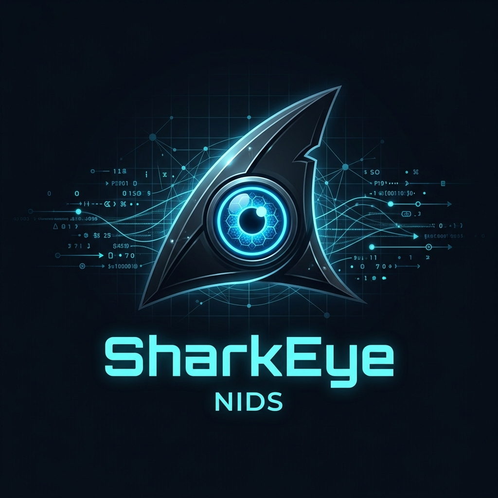

<div align="center">



# SharkEye — Network Intrusion Detection System

[](https://python.org)
[](https://flask.palletsprojects.com)
[](https://raspberrypi.com)
[](https://ollama.com)
[](LICENSE)
[]()
[]()

> **Real-time AI-powered network traffic analysis running entirely on a Raspberry Pi 5 — no cloud, no data leaving your network.**

[Features](#-features) • [Architecture](#-architecture) • [Quick Start](#-quick-start) • [Configuration](#-configuration) • [API Reference](#-api-reference) • [Security](#-security)

</div>

---

## 📖 Overview

**SharkEye** is a self-hosted Network Intrusion Detection System (NIDS) that combines deep packet inspection with local Large Language Model inference to detect and report malicious network activity — all running on a **Raspberry Pi 5**, entirely offline.

Every 30 seconds, SharkEye captures a batch of live traffic using `tshark`, extracts packet metadata, deduplicates it, and feeds it to a locally-running LLM (`qwen2.5-coder:3b` via Ollama) which classifies anomalies, identifies malicious patterns, and generates security recommendations — all displayed in a premium real-time web dashboard.

```
┌─────────────────────────────────────────────────────────┐
│                 Your Network Traffic                    │
└───────────────────────┬─────────────────────────────────┘
                        │ tshark (-T ek NDJSON)
                        ▼
              ┌─────────────────┐
              │  SharkEye Core  │  Raspberry Pi 5
              │  (app.py)       │  Running as root
              └────────┬────────┘
                       │
          ┌────────────┼────────────┐
          ▼            ▼            ▼
    Packet Stats   LLM Analysis  History Store
    (protocol,     (Ollama /     (JSON / day,
     top IPs)      qwen2.5)      local disk)
          │            │            │
          └────────────┴────────────┘
                       │ SSE + REST
                       ▼
           ┌───────────────────────┐
           │  Web Dashboard        │
           │  (dark-mode, charts,  │
           │   live log terminal)  │
           └───────────────────────┘
```

---

## ✨ Features

### 🔒 Secure Access
- **Login portal** with bcrypt-hashed credentials (cost factor 12)
- **Secret credential store** — hashed password stored in a non-obvious system path derived from the script's SHA-256 fingerprint
- **Session-based authentication** — all routes protected; sessions survive server restart
- **Logout** with full activity logging

### 📡 Live Network Capture
- **Interface picker in the Web UI** — shows all network interfaces with State (UP/DOWN), IP address, MAC address, and **internet connectivity check** (live ping to 8.8.8.8)
- Auto-selects the best (internet-connected) interface
- Batched `tshark` capture in **EK (NDJSON)** format — reliable parsing vs `-T json`
- Live `stderr` streamed directly to the web terminal panel

### 🤖 AI-Powered Analysis
- Each 30-second batch is analysed by **Ollama** running `qwen2.5-coder:3b` locally
- LLM outputs structured JSON: anomaly count, malicious activity list, summary, recommendations
- Works **100% offline** — no data leaves the device

### 📊 Real-Time Dashboard
- **5 clickable stat cards** → each opens a full detail modal
- **Packets per Cycle** line chart (Chart.js)
- **Protocol distribution** donut chart (TCP/UDP/Other)
- **Top 10 source IPs** ranked table with volume bars
- **Live log terminal** via Server-Sent Events (SSE) with auto-scroll and colour-coded severity

### 📅 Persistent Day-by-Day History
- Every batch written to `sharkeye_history/sharkeye_YYYY-MM-DD.json` (atomic writes)
- **Session tracking** — start time, end time, duration, interface per run
- **History modal** with date sidebar → session cards → per-batch drill-down with expandable malicious activity, recommendations, and IP tables

### 🔄 Service Management
- `ollama serve` auto-started in background on launch
- `tshark` stderr streamed to UI live
- SSE heartbeat (`: ping` comment) keeps connections alive through Pi's TCP stack

---

## 🏗️ Architecture

### Tech Stack

| Layer | Technology |
|---|---|
| **Backend** | Python 3.10+, Flask 3.x |
| **Packet Capture** | `tshark` (Wireshark CLI) — EK/NDJSON output |
| **AI Inference** | Ollama — `qwen2.5-coder:3b` (local LLM) |
| **Auth** | `bcrypt` (cost 12) + Flask sessions |
| **Frontend** | Vanilla JS, Chart.js, SSE |
| **Storage** | JSON files (atomic `os.replace`) |
| **Hardware** | Raspberry Pi 5 (4 GB+) |
| **OS** | Raspberry Pi OS (Debian Bookworm) |

### Project Structure

```
Ultimate/
├── app.py                          # Single-file application (~2100 lines)
├── sharkeye_logo.png               # Project logo
├── sharkeye_history/               # Auto-created — daily JSON history
│   ├── sharkeye_2026-05-31.json
│   └── sharkeye_2026-06-01.json
└── README.md

# Secret credential store (auto-created, path derived from app.py SHA-256):
/var/cache/.netaudit_meta_<sha256[:12]>/
└── idxmap.bin                      # bcrypt-hashed credentials (chmod 600)
```

### Data Flow (per batch)

```
tshark capture (30s)
    │
    ▼ EK NDJSON
parse_ek_output()        → list of packet dicts
    │
    ▼
compute_stats()          → packet_count, protocol_dist, top_src_ips
    │
    ▼
dedup()                  → remove duplicate frames
    │
    ▼
make_prompt()            → structured prompt (≤180 packets)
    │
    ▼
ollama_chat()            → JSON analysis
    │
    ├──→ latest_report{}  (served by /stats)
    ├──→ history[]        (chart timeline)
    └──→ save_batch_to_history()  → sharkeye_YYYY-MM-DD.json
```

---

## 🚀 Quick Start

### Prerequisites

| Requirement | Install |
|---|---|
| Python 3.10+ | `sudo apt install python3 python3-pip` |
| tshark | `sudo apt install tshark` |
| Ollama | `curl -fsSL https://ollama.com/install.sh \| sh` |
| Python packages | See below |

### 1. Clone the repository

```bash
git clone https://github.com/<your-username>/SharkEye.git
cd SharkEye
```

### 2. Install Python dependencies

```bash
pip install flask bcrypt ollama
```

### 3. First-Time Setup (Important)

Before starting the server, run the `initials.py` setup script. This will launch a temporary WebUI setup portal.

```bash
python3 initials.py
```

1. Open the **Setup URL** printed in your terminal (e.g., `http://<raspberry-pi-ip>:5000`) in your browser.
2. Review your system resources and accept the Terms and Conditions.
3. Click **Generate Product Key** and **copy the SHA-256 key** shown on screen (you will need it to unlock the app).
4. The setup portal will automatically shut down, freeing up the port.

### 4. Run the Server

Run the main application as root (required for raw packet capture):

```bash
sudo python3 app.py
```

### 5. Access and Unlock

Navigate to the Web UI at the IP address printed by the setup script (e.g., `http://<raspberry-pi-ip>:5000`).

1. **Login** with the default credentials:
   - User ID  : `sharkeye`
   - Password : `mintfire`
2. **Unlock**: You will be redirected to an activation page. Paste the **Product Key** generated in Step 3.
3. **Install LLM**: Click the **🤖 LLM Manager** button in the top navigation bar to download your preferred AI model (e.g., `qwen2.5-coder:3b`).
4. You are now in the dashboard!

> ⚠️ Change the default password immediately in production — see [Changing Credentials](#changing-credentials).
---

## 🖥️ Dashboard Walkthrough

### Login Screen
A secure, premium login portal with bcrypt authentication and an animated scan-line effect.

### Interface Selection
After login, the dashboard scans your network interfaces:

| # | Interface | State | IP Address | Internet | MAC |
|---|---|---|---|---|---|
| 1 | eth0 | 🟢 UP | 192.168.1.10 | ● Online | dc:a6:32:xx:xx:xx |
| 2 | wlan0 | 🟢 UP | 192.168.1.12 | ○ LAN only | b8:27:eb:xx:xx:xx |
| 3 | usb0 | 🔴 DOWN | — | ✗ None | — |

Click a row to select it, then press **▶ Start Capture**.

### Stat Cards (Clickable)
Each card opens a detail modal:

| Card | Opens |
|---|---|
| 📦 Packets (batch) | Protocol breakdown with percentages |
| 🌐 Unique Src IPs | Ranked IP table with volume bars |
| ⚡ Anomalies | Full LLM summary + recommendations |
| 🚨 Malicious | Per-event cards with `#N` labels |
| 📊 Batches | Full session batch history grid |

### History Modal (`📅 History`)
Browse every previous run:
- **Date sidebar** — green/red dots indicate malicious activity
- **Session cards** — start time, end time, duration, interface used
- **Batch rows** — `Timestamp | Packets | IPs | Anomalies | Malicious | Summary`
- Click any row to expand full LLM output, malicious events, recommendations, and top IPs

### Live Log Terminal
Real-time output from tshark, Ollama, and the capture loop — colour-coded:
- 🟢 Green — `[OK]` events
- 🟡 Yellow — `[WARN]`
- 🔴 Red — `[ERROR]`
- ⚫ Grey — `[INFO]`

---

## ⚙️ Configuration

Edit the constants at the top of `app.py`:

```python
MODEL_NAME           = "qwen2.5-coder:3b"  # Ollama model to use
SUB_CAPTURE_DURATION = 30                   # Seconds per tshark batch
MAX_PACKETS_LLM      = 180                  # Max packets sent to LLM
HISTORY_LENGTH       = 30                   # Chart timeline length
LOG_MAXLEN           = 600                  # SSE log ring buffer size
HISTORY_DIR          = "./sharkeye_history" # Where daily JSON is saved
```

### Changing the LLM Model

```bash
ollama pull llama3.2:3b       # Lighter, faster
ollama pull mistral:7b        # Larger, more accurate
```

Then update `MODEL_NAME` in `app.py`.

### Changing Credentials

The credential store is a bcrypt-hashed JSON file. Open a Python shell:

```python
import bcrypt, json

new_hash = bcrypt.hashpw(b"new_password", bcrypt.gensalt(12)).decode()
store = {"sharkeye": new_hash}

# Path is printed at startup as "Auth store: ..."
with open("/var/cache/.netaudit_meta_<hash>/idxmap.bin", "w") as f:
    json.dump(store, f)
```

Or **delete `idxmap.bin`** and restart — it will be regenerated with the defaults.

---

## 🔐 Security

### Authentication Architecture

```
app.py absolute path
       │
       ▼ SHA-256
  <12-char hex>
       │
       ▼
/var/cache/.netaudit_meta_<12chars>/
└── idxmap.bin   ← {"sharkeye": "$2b$12$...bcrypt hash..."}
    chmod 600    ← only root can read
```

- Credential directory **name is derived from the script path** — moving `app.py` creates a fresh store
- File named `idxmap.bin` — innocuous, looks like an index file
- Stored under `/var/cache/` (root-only on Linux)
- bcrypt salt factor 12 — ~300 ms per hash check, resistant to brute-force
- Flask session secret **derived from script path** (different tag) — deterministic across restarts
- All routes require an active session; unauthenticated requests → `302 /login`
- **All login attempts logged** (success and failure) to the SSE log stream

### Threat Model

| Threat | Mitigation |
|---|---|
| Network sniffing of credentials | Run behind a VPN or access via SSH tunnel |
| Brute-force login | bcrypt cost 12; add IP rate-limiting if exposed |
| Credential file discovery | Hidden path derived from SHA-256, mode 600 |
| Session hijacking | Flask session with strong derived secret key |
| LLM prompt injection | Packet data is structured, not user input |

> **⚠️ Recommended:** Access only on your local network or via `ssh -L 5000:localhost:5000 pi@<pi-ip>`.

---

## 📡 API Reference

All endpoints require an authenticated session (`Set-Cookie` from `/login`).

| Method | Endpoint | Description |
|---|---|---|
| `GET` | `/` | Dashboard HTML |
| `GET/POST` | `/login` | Login portal |
| `GET` | `/logout` | Clear session → redirect to `/login` |
| `GET` | `/api/interfaces` | List network interfaces with state/IP/internet |
| `GET` | `/stats` | Current capture stats + latest LLM analysis |
| `POST` | `/start` | Start capture on selected interface |
| `POST` | `/stop` | Stop capture |
| `GET` | `/api/history` | List all saved dates with aggregate stats |
| `GET` | `/api/history/<YYYY-MM-DD>` | Full day JSON (sessions + batches) |
| `GET` | `/logs/stream` | SSE stream of live log output |

### `/stats` Response Schema

```json
{
  "capturing": true,
  "ollama_ok": true,
  "tshark_ok": true,
  "total_packets": 1482,
  "unique_src_ips": 24,
  "anomalies_detected": 3,
  "malicious_activities": ["Port scan detected from 10.0.0.55"],
  "analysis": {
    "summary": "...",
    "anomalies_detected": 3,
    "malicious_activities": ["..."],
    "recommendations": ["..."]
  },
  "proto": { "tcp": 984, "udp": 421, "other": 77 },
  "top_src_ips": { "192.168.1.5": 312, "10.0.0.55": 89 },
  "history": [{ "timestamp": "14:32:01", "packet_count": 1482 }]
}
```

### `/api/history/<date>` Response Schema

```json
{
  "date": "2026-05-31",
  "sessions": {
    "20260531_140500": {
      "session_id": "20260531_140500",
      "interface": "eth0",
      "session_start": "2026-05-31 14:05:00",
      "session_end": "2026-05-31 15:30:00",
      "duration_s": 5100,
      "batches": [{
        "batch_num": 1,
        "timestamp": "2026-05-31 14:05:30",
        "packet_count": 1482,
        "unique_src_ips": 24,
        "anomalies": 3,
        "malicious": ["Port scan detected from 10.0.0.55"],
        "summary": "Normal home network traffic with one suspicious host.",
        "recommendations": ["Block 10.0.0.55 at the firewall level."]
      }]
    }
  }
}
```

---

## 📦 Dependencies

| Package | Purpose | Install |
|---|---|---|
| `flask` | Web framework + SSE | `pip install flask` |
| `bcrypt` | Password hashing | `pip install bcrypt` |
| `ollama` | LLM client | `pip install ollama` |
| `tshark` | Packet capture (system) | `sudo apt install tshark` |

### Auto-managed
| Tool | Purpose |
|---|---|
| `ollama serve` | LLM inference server (auto-started by app) |
| `qwen2.5-coder:3b` | Default LLM model (`ollama pull qwen2.5-coder:3b`) |

---

## 🗺️ Roadmap

- [ ] **Email / webhook alerts** when malicious activity is detected
- [ ] **IP blocklist** — auto-generate `iptables` rules from LLM recommendations
- [ ] **PCAP export** — save raw capture file per batch
- [ ] **Multi-user support** — role-based access (admin / read-only viewer)
- [ ] **Docker container** for non-Pi deployment
- [ ] **Grafana integration** — export stats to InfluxDB
- [ ] **Mobile-responsive** polish for small screens

---

## 🤝 Contributing

Pull requests are welcome! Please:

1. Fork the repo
2. Create a feature branch: `git checkout -b feature/your-feature`
3. Commit with a clear message: `git commit -m "feat: add email alerts"`
4. Open a Pull Request describing what you changed and why

For bugs, open a GitHub Issue with:
- Pi model + OS version (`uname -a`)
- Python version (`python3 --version`)
- Full error output
- Steps to reproduce

---

## 👤 Author

**Avik Samanta**
- GitHub: [Avik Samanta](https://github.com/avik-root)
- Project: SharkEye NIDS for Raspberry Pi 5

---

## 📜 License

This project is licensed under the **MIT License** — see the [LICENSE](LICENSE) file for details.

```
MIT License — Copyright (c) 2026 Avik Samanta

Permission is hereby granted, free of charge, to any person obtaining a copy
of this software and associated documentation files (the "Software"), to deal
in the Software without restriction...
```

---

<div align="center">


**Built with ❤️ on a Raspberry Pi 5**

`tshark` • `Ollama` • `Flask` • `bcrypt` • `Chart.js`

*"Your network, your rules, your AI — 100% local."*

</div>
